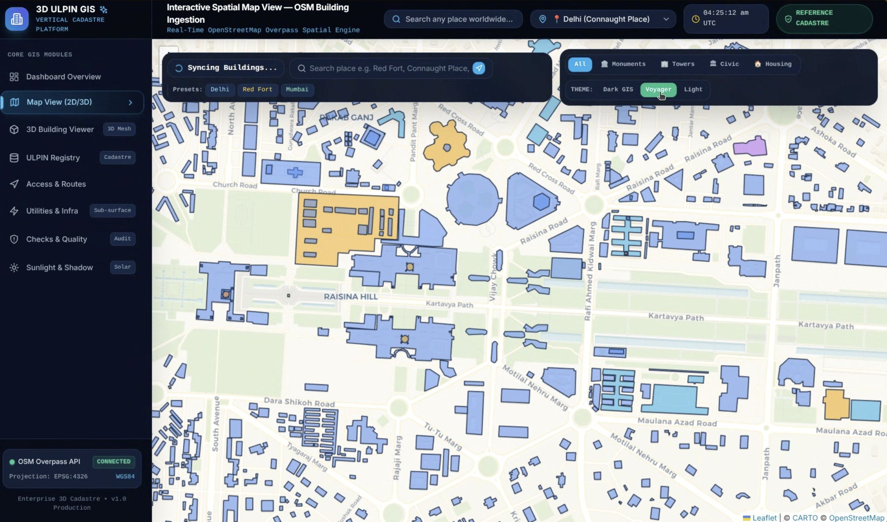
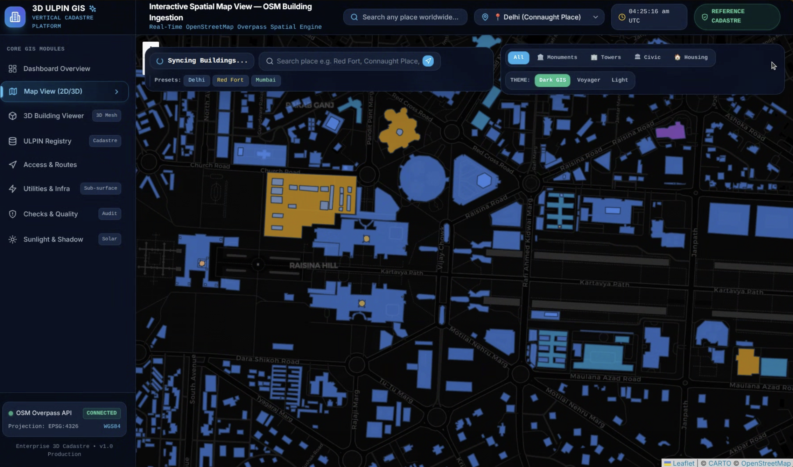
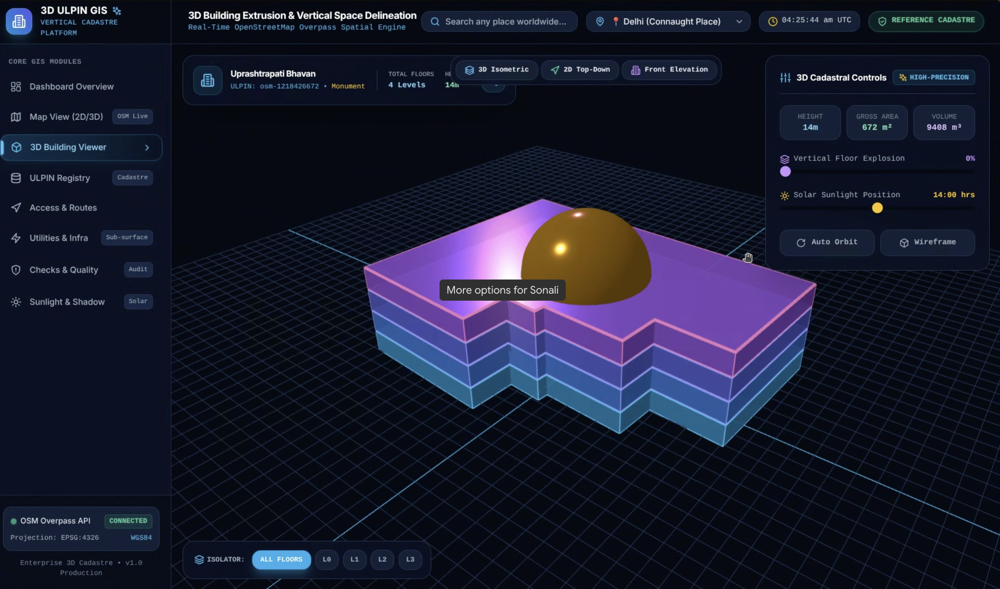
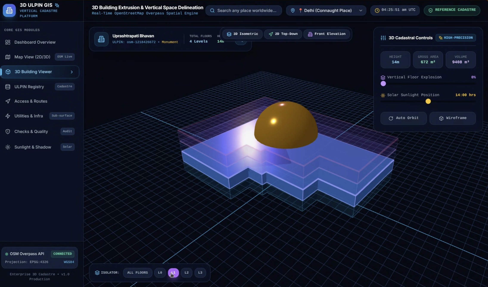
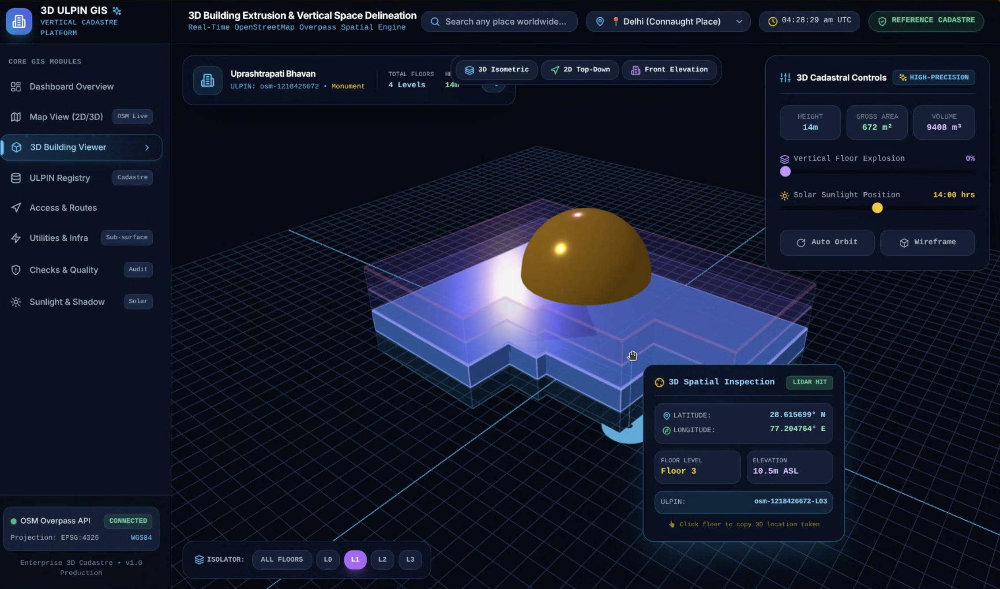
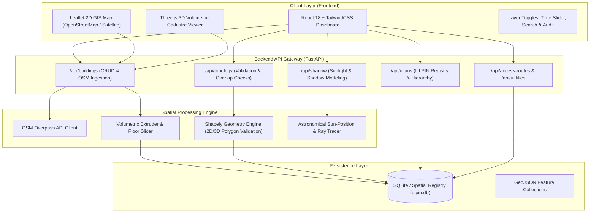
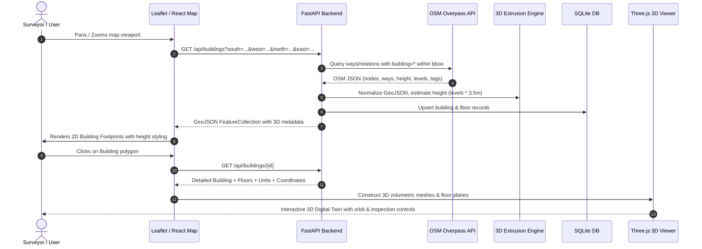

# 🌐 3D ULPIN / 3D Cadastre & Vertical Property Mapping System!

> **Next-Generation Volumetric Cadastre, 3D Land Parcel Identification (ULPIN), Subsurface Utilities & Solar Shadow Analysis Platform**

[](https://fastapi.tiangolo.com)
[](https://react.dev)
[](https://threejs.org)
[](https://leafletjs.com)
[](https://overpass-turbo.eu/)
[](https://www.python.org/)
[](#prototype-disclaimer)

---

> [!IMPORTANT]
> **Prototype Note**: This project is an advanced **proof-of-concept prototype** demonstrating how India's Unique Land Parcel Identification Number (ULPIN) standard can transition from 2D surface cadastre into a complete **3D Volumetric Digital Cadastre System (ISO 19152 LADM aligned)**. It connects real-time OpenStreetMap Overpass footprints with interactive Three.js 3D extrusions, vertical floor partitioning, multi-owner spatial units, underground utilities, and solar shadow simulations.

---

## 📸 Visual Showcase

### 1. Interactive GIS 2D/3D Cadastral View
Real-time dynamic viewport queries fetch building footprints, heights, and metadata from OpenStreetMap via Overpass API with dark/light spatial base maps and parcel boundary overlays.

| Light Mode (Surveyor Base Map) | Dark Mode (Command Center) |
|:---:|:---:|
|  |  |

---

### 2. 3D Volumetric Extrusion & Cadastral Inspection
Interactive Three.js environment generating 3D solid volumes from GIS coordinates, featuring orbit controls, level-by-level floor slicing, and spatial unit inspections.

| 3D Volumetric Building Mesh | Floor-by-Floor Unit Isolation |
|:---:|:---:|
|  |  |

---

### 3. Precision Cadastral Coordinate & Boundary Ledger
Detailed spatial vertex ledger showing exact geographic latitude/longitude polygons, vertical elevation (Z-axis relative to MSL), perimeter, area ($m^2$), and volumetric capacity ($m^3$).

<p align="center">
  
</p>

---

## 🎯 Problem Statement & Objective

Traditional cadastral systems represent land in **2D polygons (X, Y)** on the Earth's surface. However, modern urban real estate has grown vertically:
- **Multi-storey high-rises and mixed-use towers** have multiple independent property owners stacked on the exact same 2D footprint.
- **Air rights, basements, and underground transit tunnels** overlap spatially without clear 2D separation.
- **Subsurface utilities** (water mains, high-voltage conduits, gas pipes, optical fiber) lack integration with property boundaries, causing severe utility clashes during construction.

### The Solution: 3D ULPIN Cadastre
This project extends the **Unique Land Parcel Identification Number (ULPIN)** into the vertical third dimension:
1. **Vertical Disambiguation**: Every spatial volume (ground parcel, building, floor, apartment/office, utility conduit) receives a globally unique, hierarchically resolvable 3D ULPIN.
2. **Volumetric Rights & Restrictions (RRRs)**: Models legal spaces with explicit height limits, elevations, and volumetric bounds compliant with the **ISO 19152 Land Administration Domain Model (LADM)**.
3. **Integrated Infrastructure**: Combines surface land, vertical superstructures, and subterranean infrastructure within a unified digital twin.

---

## 🏗️ System Architecture



---


---

## ⚡ OpenStreetMap to 3D Extrusion Data Pipeline



---

## ✨ Key Features & Functional Modules

### 1. 🗺️ Viewport-Driven OpenStreetMap Ingestion
- Real-time querying of the OpenStreetMap **Overpass API** using bounding-box (`bbox`) geometry.
- Dynamically extracts building footprints, postal addresses, building types, `building:levels`, and explicit heights.
- Automatic height estimation fallback logic (`levels * 3.5m` or `10.0m` default).
- Caches ingested buildings and spatial boundaries locally in SQLite to prevent redundant network roundtrips.

### 2. 🧊 Three.js 3D Cadastre & Volumetric Slicing
- Converts 2D GeoJSON polygon rings into **extruded 3D geometry meshes** using custom Three.js tessellation.
- **Level-by-Level Slicing**: Isolate and inspect specific floors (Ground, Floor 1, Floor 2, Terrace).
- **Unit Subdivision**: Highlights individual apartments, commercial suites, common corridors, and parking spaces with individual volumetric fills and wireframe edges.
- Orbit, Pan, Zoom, and Preset View controls (Orthographic Top-Down, Front Elevation, Isometric 3D).

### 3. 🏷️ Hierarchical ULPIN Registry & Provenance Tracking
- Every cadastral entity carries a standardized **ULPIN** and links to its parent entity.
- Transparent provenance metadata classification:
  - `SOURCE_DATA`: Raw data ingested directly from OpenStreetMap or surveyed plans.
  - `DERIVED_DATA`: Extrapolated vertical elevations and synthetic unit partitions.
  - `ESTIMATED_DATA`: Algorithmic height calculations based on urban density rules.
  - `VERIFIED_DATA`: Official land registry records verified by cadastral authorities.

### 4. ☀️ Solar Shadow & Sunlight Ingress Simulation
- Embedded astronomical solar positioning calculator based on latitude, longitude, day of year, and hour of day.
- Computes solar azimuth and solar elevation angles in real time.
- Projects dynamic shadow polygons onto neighboring parcels to evaluate sunlight rights, solar easement compliance, and building height impact assessments.

### 5. 🛡️ Topological Validation & Integrity Checks
- Automated 2D and 3D spatial integrity audits powered by **Shapely**:
  - **Self-Intersection Check**: Verifies that parcel and building footprint boundaries do not loop or self-intersect.
  - **3D Vertical Overlap Detection**: Ensures stacked units within the same floor do not collide or breach floor boundaries.
  - **Containment Validation**: Validates that all derived building footprints stay strictly within the surveyed parent land parcel boundary.
  - **Orphan Unit Audits**: Flags any unit or floor lacking a valid parent ULPIN reference.

### 6. 🚇 Subsurface Utilities & 3D Access Routes
- Visualizes underground utilities (Water pipelines, high-voltage electrical conduits, optical fiber lines, gas mains, sewage) with specified depth, diameter, and operational status.
- Models 3D multi-level access routes (`[lat, lon, z]`) connecting street gates, building lobbies, elevator banks, and unit entrances for emergency evacuation planning and accessible navigation.

---

## 🛠️ Technology Stack

| Domain | Technology | Purpose |
| :--- | :--- | :--- |
| **Frontend Framework** | **React 18** + **Vite 5** | High-performance reactive Single Page Application |
| **Styling & UI** | **TailwindCSS 3.4** + **Lucide React** | Enterprise GIS UI wireframe styling, dark/light themes |
| **3D Rendering** | **Three.js (r161)** | Volumetric 3D cadastre extrusion, mesh shaders, orbit camera |
| **2D Mapping** | **Leaflet 1.9** + **React-Leaflet** | Interactive geospatial viewport, OSM tiles, parcel layers |
| **Backend API** | **FastAPI (Python 3.10+)** | High-speed asynchronous REST API with Swagger documentation |
| **Spatial Engine** | **Shapely 2.1** + **NumPy** | Geometric intersection, union, containment, and validity checks |
| **GIS Data Source** | **OpenStreetMap Overpass API** | Live building footprints, tags, levels, and geospatial nodes |
| **Database & ORM** | **SQLite** + **SQLAlchemy 2.0** | Local spatial registry, relational entities, provenance ledger |
| **HTTP Client** | **Axios** (Frontend) / **HTTPX** (Backend) | Asynchronous client communication and Overpass querying |

---

## 📂 Project Directory Structure

```text
sih/
├── assets/                          # Showcase UI screenshots & diagrams
│   ├── 3dBuilding.png
│   ├── dark-mapview.png
│   ├── floorCoordinates.png
│   ├── floorSelected.png
│   └── light-mapview.png
├── backend/                         # FastAPI Application
│   ├── database.py                  # SQLAlchemy engine & SQLite session setup
│   ├── main.py                      # FastAPI entry point, CORS, routers & seeding
│   ├── models.py                    # Database schema: Building, Floor, SpaceUnit, ULPIN, Utility
│   ├── schemas.py                   # Pydantic schemas for request/response serialization
│   ├── seed_data.py                 # Initial cadastral records and sample 3D towers
│   ├── routes/                      # API Endpoints
│   │   ├── buildings.py             # Overpass building retrieval & floor inspection
│   │   ├── ulpins.py                # ULPIN registry query & hierarchy tree
│   │   ├── topology.py              # Spatial integrity & overlap checks
│   │   ├── shadow.py                # Astronomical solar azimuth & shadow calculations
│   │   └── routes_utilities.py      # 3D access routes & subterranean utilities
│   └── requirements.txt             # Python backend dependencies
├── frontend/                        # React + Vite Frontend
│   ├── src/
│   │   ├── App.jsx                  # Main routing, layout, and sidebar navigation
│   │   ├── components/              # Reusable UI components
│   │   │   ├── Header.jsx           # Search bar, ULPIN quick lookup, dark/light toggle
│   │   │   ├── Sidebar.jsx          # Collapsible navigation drawer
│   │   │   └── PropertyPanel.jsx    # Right-hand drawer with unit, floor, and owner metadata
│   │   ├── pages/                   # Primary Application Views
│   │   │   ├── Dashboard.jsx        # Cadastral overview, KPI statistics & system alerts
│   │   │   ├── MapView.jsx          # 2D/3D Leaflet GIS viewport with OSM Overpass layer
│   │   │   ├── Viewer3D.jsx         # Three.js 3D Volumetric Cadastre Viewer
│   │   │   ├── UlpinRegistry.jsx    # Searchable ULPIN data table & hierarchy inspector
│   │   │   ├── ShadowAnalysis.jsx   # Solar azimuth/elevation simulation controls
│   │   │   ├── ChecksReports.jsx    # Topology validation & spatial audit reports
│   │   │   ├── AccessRoutes.jsx     # Multi-level indoor/outdoor 3D pathfinder
│   │   │   └── UtilitiesView.jsx    # Underground infrastructure mapping
│   │   └── index.css                # Tailwind directives & custom GIS scrollbar rules
│   ├── package.json                 # Frontend dependencies & scripts
│   └── vite.config.js               # Vite server config & backend API proxy
├── ulpin.db                         # SQLite spatial database registry
└── README.md                        # Project documentation
```

---

## 🚀 Quick Start & Installation Guide

### Prerequisites
- **Python**: Version `3.10` or higher
- **Node.js**: Version `18.0.0` or higher (`npm` included)
- **Git**

---

### Step 1: Clone the Repository
```bash
git clone https://github.com/GarvitOfficial/visionaryMapping.git
cd "visionaryMapping"
```

---

### Step 2: Set Up Backend (FastAPI)

1. Create and activate a Python virtual environment:
   ```bash
   python3 -m venv .venv
   source .venv/bin/activate       # On Windows: .venv\Scripts\activate
   ```

2. Install backend dependencies:
   ```bash
   pip install -r backend/requirements.txt
   ```

3. Launch the FastAPI server:
   ```bash
   python3 -m uvicorn main:app --app-dir backend --host 127.0.0.1 --port 8000 --reload
   ```

4. Verify backend health:
   - **Health Endpoint**: [http://127.0.0.1:8000/api/health](http://127.0.0.1:8000/api/health)
   - **Interactive Swagger Docs**: [http://127.0.0.1:8000/docs](http://127.0.0.1:8000/docs)

---

### Step 3: Set Up Frontend (React + Vite)

1. Open a new terminal window and navigate to `frontend`:
   ```bash
   cd frontend
   ```

2. Install Node packages:
   ```bash
   npm install
   ```

3. Launch Vite development server:
   ```bash
   npm run dev
   ```

4. Open your browser and navigate to:
   ```text
   http://localhost:5173
   ```

---

## 📡 API Reference Overview

| Method | Endpoint | Description | Query / Body Params |
| :--- | :--- | :--- | :--- |
| `GET` | `/api/health` | Health check & active data source status | None |
| `GET` | `/api/buildings` | Fetches building footprints from OSM Overpass & cache | `south`, `west`, `north`, `east` |
| `GET` | `/api/buildings/{id}` | Returns building record with floors, units & 3D vertices | `id` (e.g. `osm-123456`) |
| `GET` | `/api/ulpins` | Search and list registered 3D ULPIN records | `search`, `entity_type`, `limit` |
| `GET` | `/api/ulpins/hierarchy/{ulpin}` | Returns complete parent-to-child ULPIN tree | `ulpin` identifier |
| `GET` | `/api/topology/check` | Runs automated 2D/3D topological integrity checks | None |
| `POST` | `/api/shadow/calculate` | Calculates solar position and shadow projection polygon | `{ "lat", "lon", "height", "datetime" }` |
| `GET` | `/api/access-routes` | Lists 3D indoor/outdoor navigation routes | `building_id` (optional) |
| `GET` | `/api/utilities` | Fetches underground utility networks (water, gas, fiber) | `building_id`, `utility_type` |

---

## 🔮 Prototype Roadmap

- [x] Real-time OpenStreetMap Overpass building footprint ingestion
- [x] Three.js volumetric extrusion from 2D GIS coordinates
- [x] Level-by-level floor isolation and unit wireframing
- [x] ULPIN hierarchical registry (Parcel $\rightarrow$ Building $\rightarrow$ Floor $\rightarrow$ Unit)
- [x] Astronomical solar shadow simulation
- [x] Automated topological self-intersection and overlap verification
- [x] Subsurface utilities and 3D emergency route visualization
- [ ] **Phase 2**: OGC **CityGML 3.0** & **IndoorGML** standardized import/export
- [ ] **Phase 3**: PostgreSQL / **PostGIS 3D** (`SFCGAL`) enterprise backend integration
- [ ] **Phase 4**: Augmented Reality (AR) mobile inspection app for cadastral field surveyors
- [ ] **Phase 5**: Permissioned blockchain registry for tamper-evident vertical title deeds

---
